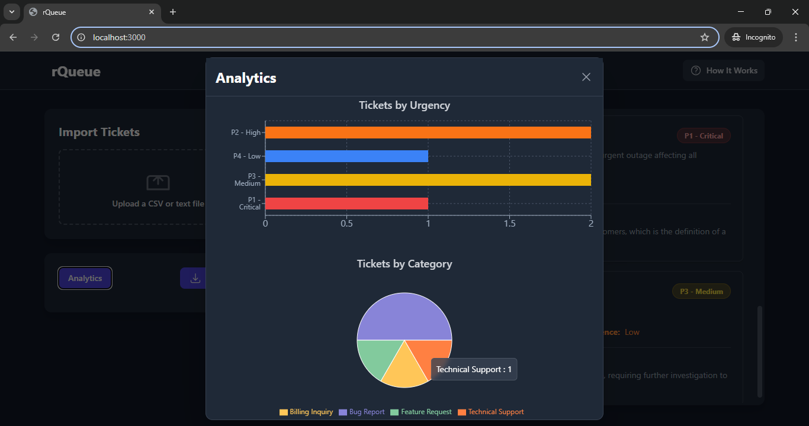

## Run Locally

**Prerequisites:**  Node.js

1. Install dependencies:
   `npm install`
2. Set the `GEMINI_API_KEY` in [.env.local](.env.local) to your API key
3. Run the app:
   `npm run dev`

## View Application

**URL**

## User Guide

1. Import Your Tickets

   Upload file:
   Supports CSV files.
   For CSVs, ensure you have columns named:

   `id, subject, body, createdAt`

2. AI-Powered Queue

   Once imported, the data is sent to a powerful AI model which analyzes each ticket based on a specific set of rules.

   The AI assesses:

   **Category**: Assigns labels like Bug Report, Feature Request, Billing Inquiry, Technical Support, or Other.

   **Urgency (P1–P4)**: Prioritizes based on keywords (e.g., “outage”, “critical error”, “delay”) and the age of the ticket.

   **Suggested Assignee**: Recommends the best team (e.g., Frontend, Backend, DevOps, Testing, Billing) to handle the issue.

   **Confidence**: Flags tickets that are ambiguous or lack sufficient details so you can review them manually.

3. Review and Export

   The tickets are displayed in a clean, easy-to-read list. You can quickly see the AI’s suggestions and reasoning.

   Features:

   **Analytics Dashboard**:
   Visualizes category and urgency trends over time.

   **Export to CSV**:
   Once you’re happy with the triage results, export the categorized and prioritized data (including AI’s confidence and suggested team) as a .csv file for reporting or integration with other tools.

## How It Works

1. Import tickets (CSV or plain text).

2. Run categorization — keywords (like “bug”, “invoice”, “request”) map tickets to one of the five defined categories.

3. Urgency is assigned based on:

   - Keyword severity (e.g., “critical”, “down”, “urgent”)

   - Ticket age (older tickets increase urgency)

4. Next Assignee/Team is suggested based on category:

   - Bug Reports → QA / Engineering

   - Feature Requests → Product Team

   - Billing → Finance

   - Technical Support → Support Team

## Running Tests

```bash
# Run all tests once
npm test

# Run tests in watch mode
npm run test:watch

# Run tests with coverage report
npm run test:coverage
```

```bash
npm test                   # Run main tests (components + utils)
npm run test:watch         # Run tests in watch mode
npm run test:coverage      # Generate coverage report
npm run test:components    # Run only component tests
npm run test:utils         # Run only utility tests
npm run test:services      # Run only service tests
npm run test:app           # Run only app tests
npm run test:all           # Run all tests including problematic ones
```
# Project Structure

This project follows a clean separation between source code and tests:

```
rQueue/
├── src/                          # All source code
│   ├── components/               # React components
│   │   ├── AnalyticsDashboard.tsx
│   │   ├── Header.tsx
│   │   ├── HowItWorksModal.tsx
│   │   ├── icons.tsx
│   │   ├── TicketCard.tsx
│   │   ├── TicketImporter.tsx
│   │   └── TicketList.tsx
│   ├── services/                 # API and external services
│   │   └── geminiService.ts
│   ├── utils/                    # Utility functions
│   │   └── ticketHelpers.ts
│   ├── App.tsx                   # Main application component
│   ├── constants.ts              # Application constants
│   ├── index.css                 # Global styles
│   ├── metadata.json             # Application metadata
│   └── types.ts                  # TypeScript type definitions
├── test/                         # All test files
│   ├── app/                      # App-level tests
│   │   └── App.test.tsx
│   ├── components/               # Component tests
│   │   ├── Header.test.tsx
│   │   └── TicketCard.test.tsx
│   ├── services/                 # Service tests
│   │   └── geminiService.test.ts
│   ├── utils/                    # Utility tests
│   │   └── ticketHelpers.test.ts
│   └── setupTests.ts             # Test configuration
├── index.html                    # HTML entry point
├── index.tsx                     # React entry point
├── jest.config.js                # Jest configuration
├── package.json                  # Dependencies and scripts
├── tailwind.config.js            # Tailwind CSS configuration
├── tsconfig.json                 # TypeScript configuration
├── vite.config.ts                # Vite configuration
└── README.md                     # Project documentation
```

## Screenshots

1. Queued Tickets


2. Analytics

